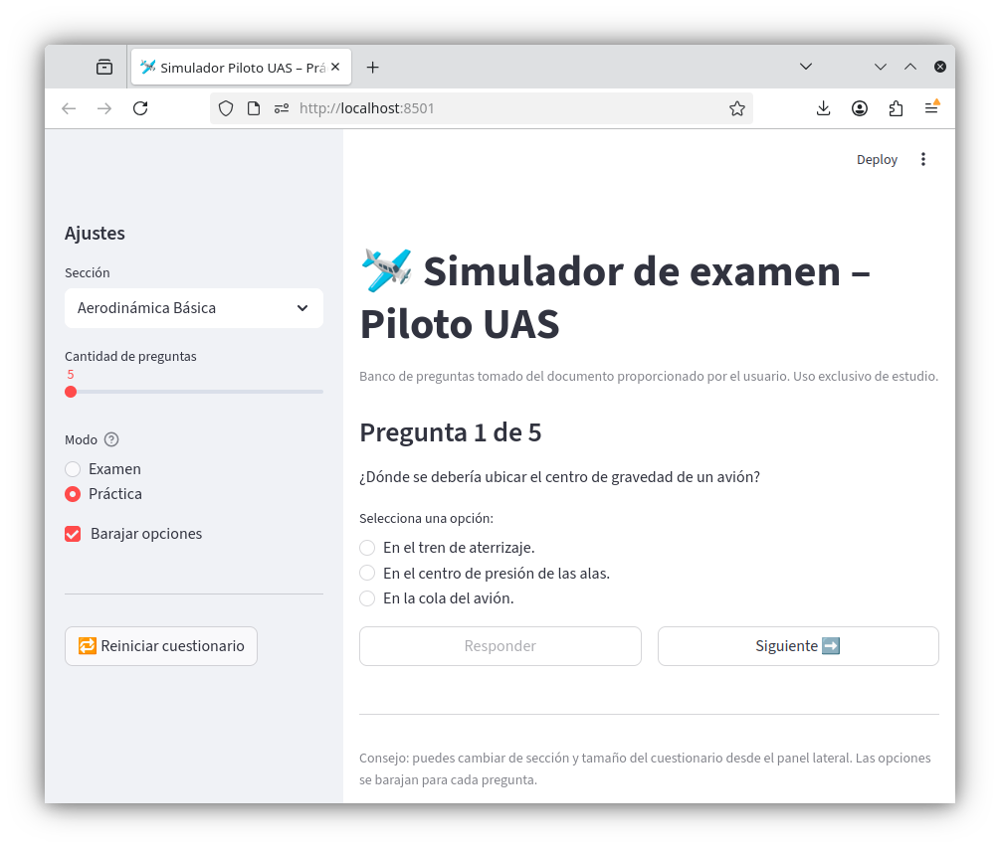

# preguntasUAS

Simulador de preguntas tipo examen para el piloto remoto UAS (RAC 100, Aerocivil). La interfaz está hecha con [Streamlit](https://streamlit.io/); los datos están en `questions_sample.csv`.

## Vista previa



---

## Desarrollo (local)

Requisitos: Python 3.10+ (probado con 3.11).

```bash
cd preguntasUAS
python3 -m venv .venv
source .venv/bin/activate
pip install streamlit pandas
streamlit run app.py
```

Se abre en el navegador (por defecto `http://localhost:8501`). El proceso debe ejecutarse **desde el directorio del proyecto** para que cargue `questions_sample.csv`.

---

## Instalación en producción (Linux + systemd)

Ajusta rutas (`/opt/preguntasUAS`) y usuario/grupo (`www-data` u otro) según tu servidor.

### 1. Copiar el proyecto en el servidor

Incluye al menos: `app.py`, `questions_sample.csv` y (recomendado) un entorno virtual creado en el mismo servidor.

```bash
sudo mkdir -p /opt/preguntasUAS
# Copiar archivos aquí (git clone, rsync, etc.)
cd /opt/preguntasUAS
sudo python3 -m venv .venv
sudo .venv/bin/pip install --upgrade pip
sudo .venv/bin/pip install streamlit pandas
sudo chown -R www-data:www-data /opt/preguntasUAS
```

Comprueba a mano (una vez):

```bash
cd /opt/preguntasUAS
sudo -u www-data .venv/bin/streamlit run app.py \
  --server.headless=true \
  --server.address=127.0.0.1 \
  --server.port=8501
```

`127.0.0.1` deja Streamlit solo accesible en la máquina; delante suele ir **nginx** (o similar) con HTTPS. Si no usas proxy, usa `0.0.0.0` y restringe con firewall o red privada.

### 2. Unidad systemd

`/etc/systemd/system/preguntas-uas.service`:

```ini
[Unit]
Description=Preguntas UAS Streamlit app
After=network.target

[Service]
Type=simple
User=www-data
Group=www-data
WorkingDirectory=/opt/preguntasUAS
Environment="PATH=/opt/preguntasUAS/.venv/bin:/usr/local/bin:/usr/bin"
ExecStart=/opt/preguntasUAS/.venv/bin/streamlit run app.py \
  --server.headless=true \
  --server.address=127.0.0.1 \
  --server.port=8501
Restart=always
RestartSec=5

[Install]
WantedBy=multi-user.target
```

Activar:

```bash
sudo systemctl daemon-reload
sudo systemctl enable --now preguntas-uas.service
sudo systemctl status preguntas-uas.service
```

Logs:

```bash
journalctl -u preguntas-uas.service -f
```

### 3. Proxy inverso (recomendado)

Configura nginx (u otro) para escuchar en 80/443 y hacer `proxy_pass` a `http://127.0.0.1:8501`, incluyendo soporte WebSocket (`Upgrade`, `Connection`) tal como recomienda la documentación de Streamlit para despliegue detrás de proxy.

### Seguridad

Sin capa extra, la aplicación es accesible a quien tenga URL. Para Internet público valorar VPN, restricción por IP, o autenticación en el proxy.
